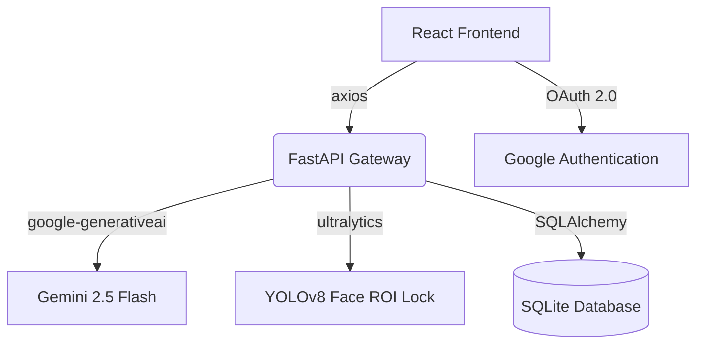

# 🧠 Silent Signal: The Agentic Neural Mesh for Mental Health

[](https://mentalhealth-neuralmesh.onrender.com) 
[](https://vercel.com) 
[](https://render.com) 
[](https://deepmind.google)

> *"Silence is not empty; it is full of answers."*

**Silent Signal** is a hyper-personalized mental health ecosystem designed to bridge the gap between biological distress signals and immediate clinical psychological support. Unlike traditional chatbots, our platform is **Agentic**—it actively senses distress through computer-vision-based biometrics and intervenes dynamically before a crisis occurs.

---

## 🌟 Core Features

### 1. Neural Mesh (Live Analysis)
The central nervous system of the application. A glowing, animated SVG Orb visualizes the user's real-time mental state, shifting colors dynamically (Blue for Calm, Red for Stress) based on live biometric data.

### 2. Biometric Resonance (rPPG Scanner)
Non-invasive diagnosis using computer vision.
* **Technology:** Uses the device camera to track face micro-movements (Remote Photoplethysmography).
* **Metrics:** Extracts **Heart Rate (BPM)** and **Respiration Rate** without requiring physical wearables.
* **Smart Flow:** Auto-triggers the "Dr. AI" consultation if high stress levels are registered.

### 3. Dr. AI (Hybrid Intelligence)
A next-generation empathetic therapist powered by a **Multi-Model Pipeline**:
* **Reasoning (Google Gemini 2.5 Flash):** Generates medically grounded, context-aware CBT therapeutic advice.
* **Vitals-Aware:** Adapts tone and guidance dynamically based on your current heart rate and anxiety score.
* **Hands-Free:** Supports real-time browser voice recognition dictation during acute panic states.

### 4. Neuro-Nutrition & Pharmacy Engine
* **Diet Plans:** Analyzes stress levels to suggest meal plans containing cortisol-lowering nutrients.
* **Curated Supplements Store:** Purchase supplements (Ashwagandha, Magnesium) tailored to current stress scores.
* **Full Cart & Invoicing:** Features a simulation payment system with custom-generated, downloadable PDF invoices.

### 5. Expert Care Loop (Telehealth)
* **Smart Booking:** Recommends medical specialists (Psychiatrists, Neurologists) based on anxiety levels.
* **Consultations:** Select dates, schedule appointments, and connect securely.

### 6. Emergency SOS Dashboard
* High-contrast distress interface.
* Generates a dynamic QR health card containing current vitals for first responders to scan instantly.

---

## 🏗️ Technical Architecture



* **Frontend:** React.js, Tailwind CSS/Glassmorphism, SVG Visualizations, Lucide React, Axios.
* **Backend:** Python FastAPI, SQLite, SQLAlchemy ORM, Uvicorn.
* **AI & Computervision:** Google Gemini API, YOLOv8 (`ultralytics`), Pandas.

---

## ⚙️ Local Development Setup

### Prerequisites
* Python 3.10+
* Node.js v18+

### Setup & Installation

1. **Clone the repository:**
   ```bash
   git clone https://github.com/vanimalhotra22/MentalHealth-NeuralMesh.git
   cd MentalHealth-NeuralMesh
   ```

2. **Backend Setup:**
   ```bash
   cd "imagine cup/backend"
   python -m venv venv
   .\venv\Scripts\activate
   pip install -r requirements.txt
   pip install pandas python-dotenv
   ```
   *Create a `.env` file in `backend/`:*
   ```env
   GEMINI_API_KEY=your_gemini_api_key
   GOOGLE_CLIENT_ID=your_google_client_id
   EMAIL_USER=your_gmail_address
   EMAIL_PASS=your_gmail_app_password
   ```

3. **Frontend Setup:**
   ```bash
   cd "../frontend"
   npm install
   ```
   *Create a `.env` file in `frontend/`:*
   ```env
   REACT_APP_API_URL=http://localhost:8000
   REACT_APP_GOOGLE_CLIENT_ID=your_google_client_id
   ```

### Running Locally

* **Run Backend (Terminal 1):**
  ```bash
  cd "imagine cup/backend"
  .\venv\Scripts\activate
  uvicorn main:app --port 8000 --reload
  ```
* **Run Frontend (Terminal 2):**
  ```bash
  cd "imagine cup/frontend"
  npm start
  ```

---

## 🚀 Cloud Deployment

### 1. Backend (Hosted on Render)
Render is used for backend hosting to accommodate the PyTorch dependencies and maintain database storage.
* **Root Directory:** `imagine cup/backend`
* **Build Command:** `pip install -r requirements.txt && pip install pandas python-dotenv`
* **Start Command:** `uvicorn main:app --host 0.0.0.0 --port $PORT`
* **Environment Variables:** Copy all values from `backend/.env`.

### 2. Frontend (Hosted on Vercel)
* **Root Directory:** `imagine cup/frontend`
* **Build Settings:** Framework preset `Create React App`
* **Environment Variables:**
  * `REACT_APP_API_URL` = `https://your-backend.onrender.com`
  * `REACT_APP_GOOGLE_CLIENT_ID` = `your_google_client_id`

---

## 🔒 Security & Medical Disclaimer
Silent Signal is an AI-powered assistant designed for distress reduction and therapy simulation. It does not replace professional clinical diagnosis. In case of emergencies, users are encouraged to utilize the **SOS Dashboard** to contact human experts immediately.
